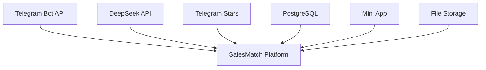
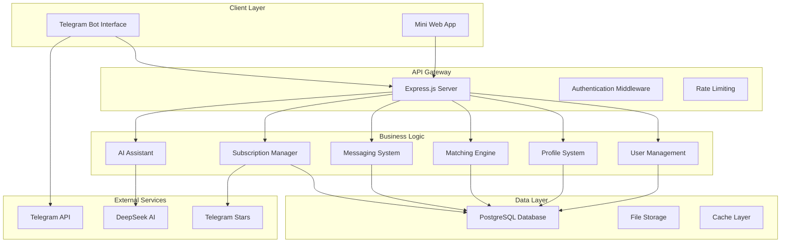
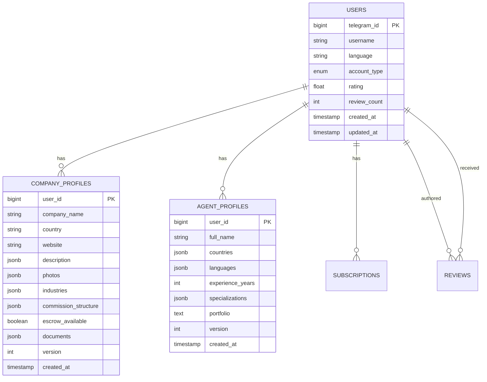
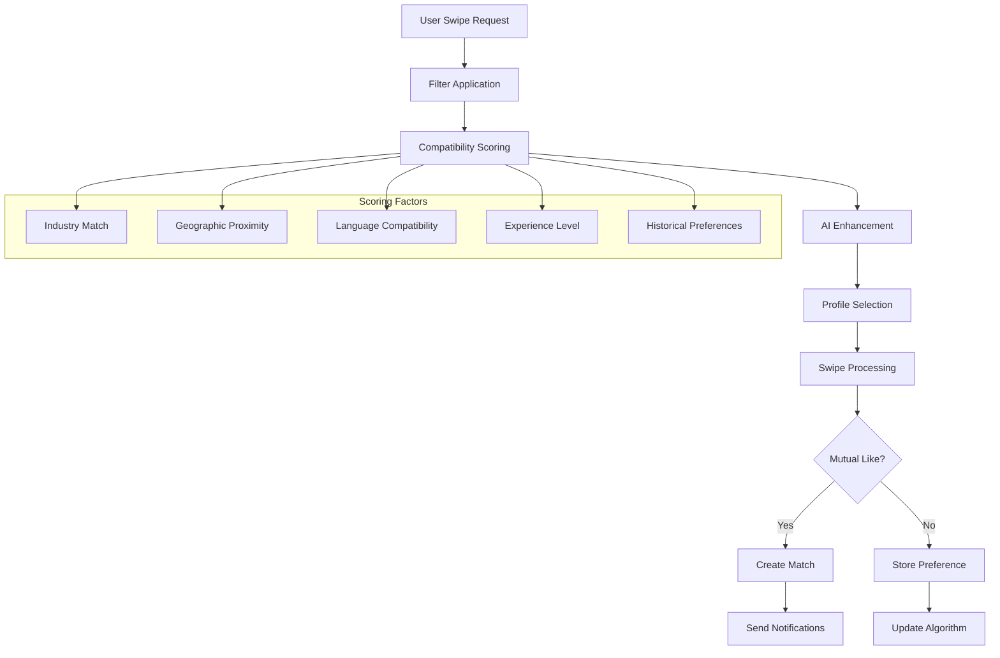
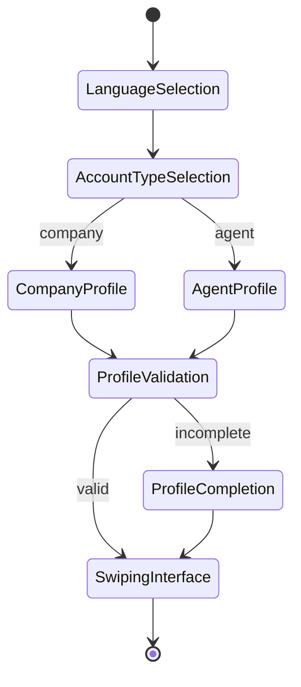
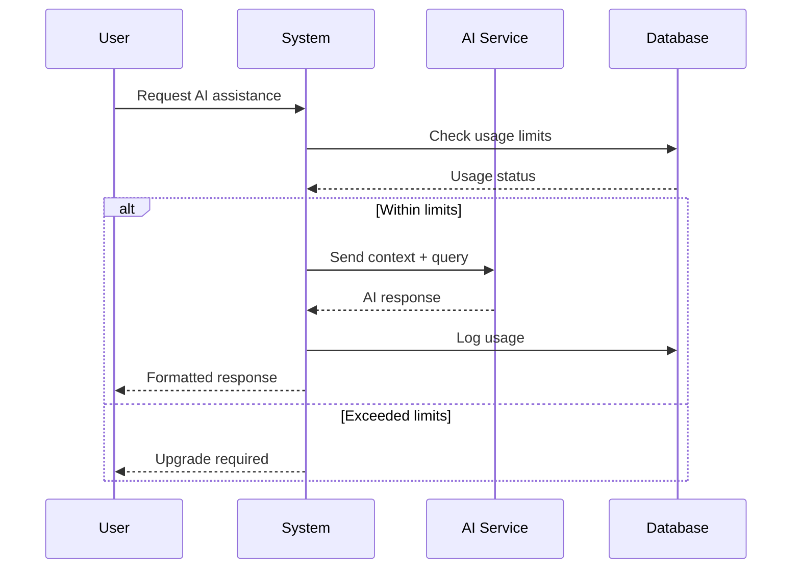
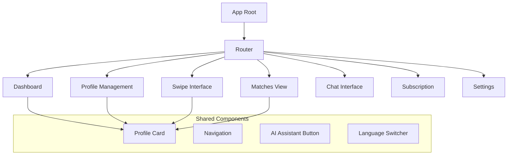
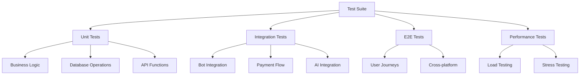

# B2B Sales Matching Platform - Design Document
## SalesMatch Pro for Deep Fon Corporation

### Overview

A comprehensive enterprise-grade B2B Sales Matching Platform built as a Telegram Bot + Mini App ecosystem. The platform connects companies seeking sales representatives with qualified agents globally, featuring intelligent matching algorithms, secure communication, and subscription-based monetization.

**Key Components:**
- Telegram Bot for user onboarding and notifications
- Mini Web App for rich interactions and profile management
- AI-powered matching engine with DeepSeek integration
- Secure messaging system with subscription controls
- Multi-language support (15+ languages)
- Telegram Stars payment integration

---

## Technology Stack & Dependencies

### Core Technologies
- **Backend:** Node.js with Express.js framework
- **Database:** PostgreSQL with connection pooling
- **Bot Framework:** Telegraf.js for Telegram Bot API
- **Frontend:** React.js for Mini App interface
- **AI Integration:** DeepSeek API for intelligent matching
- **Payment:** Telegram Stars for subscription processing
- **Authentication:** Telegram WebApp authentication

### External Dependencies


---

## Architecture

### System Architecture Overview


### Modular Architecture Design

#### Core Infrastructure Module
- **Database Connection Management:** Connection pooling with migration system
- **Configuration Management:** Environment-specific settings with safe extension
- **Logging & Error Handling:** Centralized error tracking and logging
- **Validation System:** Input sanitization and data validation

#### Telegram Bot Core Module
- **Session Management:** User state persistence across interactions
- **Command Registration:** Conflict-free command handling system
- **Multi-language Support:** Dynamic language switching (15+ languages)
- **Middleware Pipeline:** Extensible middleware for authentication and logging

#### Profile Management Module
- **Dual Profile System:** 
  - Company profiles with industry classification
  - Agent profiles with specialization tracking
- **Version Control:** Profile change history and rollback capability
- **Document Management:** Secure file upload and organization
- **Validation Engine:** Profile completeness scoring

---

## Component Architecture

### User Management System


### Matching Engine Architecture


### Messaging System Architecture
- **Subscription-Gated Messaging:** Pro/Business plans enable direct communication
- **Thread Management:** Organized conversation history per match
- **Message Encryption:** Secure end-to-end message handling
- **Notification System:** Real-time message delivery via Telegram

---

## API Endpoints Reference

### Authentication & User Management
```
POST /api/v1/auth/validate
GET  /api/v1/users/profile
PUT  /api/v1/users/profile
POST /api/v1/users/language
```

### Profile Management
```
GET  /api/v1/profiles/profile
PUT  /api/v1/profiles/profile
POST /api/v1/profiles/documents/upload
GET  /api/v1/profiles/completion-score
```

### Matching System
```
GET  /api/v1/matching/swipe/next?filters={json}
POST /api/v1/matching/swipe
GET  /api/v1/matching/matches
GET  /api/v1/matching/swipe/history
```

### Messaging
```
GET  /api/v1/messages/:matchId
POST /api/v1/messages/:matchId
GET  /api/v1/messages/conversations
```

### Subscription Management
```
GET  /api/v1/subscription/status
POST /api/v1/subscription/create-invoice
POST /api/v1/subscription/process-payment
GET  /api/v1/subscription/usage
```

### AI Assistant
```
POST /api/v1/ai/profile-suggestions
POST /api/v1/ai/message-templates
POST /api/v1/ai/matching-insights
```

---

## Data Models & Database Schema

### Core Tables Structure
```sql
-- Users table with account type differentiation
CREATE TABLE users (
    telegram_id BIGINT PRIMARY KEY,
    username VARCHAR(255),
    language VARCHAR(10) DEFAULT 'en',
    account_type user_type_enum,
    rating DECIMAL(3,2) DEFAULT 0,
    review_count INTEGER DEFAULT 0,
    created_at TIMESTAMP DEFAULT NOW(),
    updated_at TIMESTAMP DEFAULT NOW()
);

-- Matching system with status tracking
CREATE TABLE matches (
    id UUID PRIMARY KEY DEFAULT gen_random_uuid(),
    company_id BIGINT REFERENCES users(telegram_id),
    agent_id BIGINT REFERENCES users(telegram_id),
    status match_status_enum DEFAULT 'pending',
    created_at TIMESTAMP DEFAULT NOW(),
    matched_at TIMESTAMP,
    UNIQUE(company_id, agent_id)
);

-- Subscription system
CREATE TABLE subscriptions (
    user_id BIGINT PRIMARY KEY REFERENCES users(telegram_id),
    plan_type subscription_plan_enum,
    status VARCHAR(20) DEFAULT 'active',
    starts_at TIMESTAMP,
    expires_at TIMESTAMP,
    payment_id VARCHAR(255),
    auto_renew BOOLEAN DEFAULT true,
    created_at TIMESTAMP DEFAULT NOW()
);
```

### Profile Data Models
- **Company Profiles:** Industry categorization, commission structures, document portfolios
- **Agent Profiles:** Multi-country operation, language proficiency, specialization areas
- **Version Control:** Track profile changes for audit and rollback capabilities

---

## Business Logic Layer

### User Onboarding Flow


### Matching Algorithm Logic
1. **Initial Filtering:** Geographic, industry, and basic compatibility filters
2. **Scoring Engine:** Multi-factor compatibility scoring with AI enhancement
3. **Diversity Injection:** Prevent algorithm bias with random selection elements
4. **Learning System:** Continuous improvement based on user interactions

### Subscription Business Logic
- **Tier System:** Free (limited), Pro (messaging), Business (unlimited + AI)
- **Usage Tracking:** AI request limits, message quotas, feature access control
- **Auto-renewal:** Telegram Stars integration with automated billing cycles

---

## AI Integration Architecture

### DeepSeek API Integration


### AI Assistant Features
- **Profile Optimization:** Automated suggestions for profile improvement
- **Message Templates:** Context-aware conversation starters
- **Matching Insights:** Explanation of compatibility factors
- **Industry Analysis:** Market trends and opportunity identification

---

## Frontend Component Architecture

### Mini App Structure


### Component Specifications
- **Profile Cards:** Responsive design with photo galleries and key information
- **Swipe Interface:** Gesture-based interaction with animation feedback
- **Chat Interface:** Real-time messaging with subscription status indicators
- **Settings Panel:** Language selection, notification preferences, account management

---

## Security & Privacy

### Authentication Flow
- **Telegram WebApp Validation:** Cryptographic verification of init data
- **Session Management:** Secure token-based session handling
- **API Security:** Rate limiting and request validation

### Data Protection
- **Profile Privacy:** Granular visibility controls
- **Message Security:** Encrypted storage and transmission
- **File Security:** Secure upload and access control for documents
- **GDPR Compliance:** Data export and deletion capabilities

---

## Testing Strategy

### Unit Testing Framework
- **Core Logic Testing:** Comprehensive coverage of business logic
- **API Endpoint Testing:** Request/response validation
- **Database Testing:** Migration and query testing
- **Integration Testing:** Cross-module functionality verification

### Test Categories


---

## Deployment & Scalability

### Infrastructure Architecture
- **Containerization:** Docker-based deployment with orchestration
- **Database Scaling:** Read replicas and connection pooling
- **CDN Integration:** Static asset delivery optimization
- **Monitoring:** Comprehensive logging and performance tracking

### Scalability Considerations
- **Horizontal Scaling:** Load balancer configuration for multiple instances
- **Database Optimization:** Index strategies and query optimization
- **Caching Strategy:** Redis integration for session and frequently accessed data
- **AI Rate Limiting:** Efficient quota management for external API calls