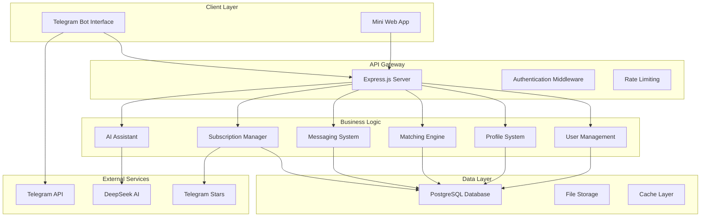

# SalesMatch Pro - Enterprise B2B Sales Matching Platform


**SalesMatch Pro** is an enterprise-grade B2B Sales Matching Platform built as a Telegram Bot + Mini App ecosystem. The platform connects companies seeking sales representatives with qualified agents globally, featuring intelligent matching algorithms, secure communication, and subscription-based monetization.

## 🏗️ **Architecture Overview**



## 🚀 **Key Features**

### **Multi-Language Support**
- 15+ languages supported (EN, RU, HI, FA, ZH, AR, ES, FR, DE, PT, IT, JA, KO, TR, PL)
- Dynamic language switching
- Localized user interface

### **Smart Matching System**
- AI-powered compatibility scoring
- Geographic and industry filtering
- Tinder-like swipe interface
- Mutual matching system

### **Subscription Plans**
- **Free**: Basic matching, 5 AI requests/day
- **Pro ($5/month)**: Unlimited messaging, 50 AI requests/day, reviews
- **Business ($20/month)**: Unlimited everything, priority matching, analytics

### **AI Integration (DeepSeek)**
- Profile optimization suggestions
- Smart message templates
- Compatibility analysis
- Market insights and trends

### **Enterprise Security**
- Telegram WebApp authentication
- Request validation and sanitization
- Rate limiting and CORS protection
- Encrypted data storage

## 📁 **Project Structure**

```
salesmatch-pro/
├── src/
│   ├── api/v1/                 # API endpoints
│   │   ├── auth.js            # Authentication API
│   │   ├── profiles.js        # Profile management
│   │   ├── matching.js        # Matching engine API
│   │   ├── messaging.js       # Messaging system
│   │   └── ai.js             # AI assistant API
│   ├── bot/                   # Telegram Bot
│   │   ├── core/              # Bot core functionality
│   │   ├── locales/           # Multi-language support
│   │   └── modules/           # Bot feature modules
│   ├── core/utils/            # Core utilities
│   │   ├── logger.js          # Centralized logging
│   │   ├── errorHandler.js    # Error management
│   │   └── validator.js       # Input validation
│   ├── database/              # Database layer
│   │   ├── connection.js      # DB connection & migrations
│   │   └── migrations/        # SQL migration files
│   ├── matching/              # Matching engine
│   │   └── SwipeEngine.js     # Core matching logic
│   ├── messaging/             # Messaging system
│   │   └── MessageManager.js  # Message handling
│   ├── payments/              # Payment & subscriptions
│   │   └── SubscriptionManager.js
│   ├── ai/                    # AI integration
│   │   └── AIAssistant.js     # DeepSeek integration
│   ├── miniapp/               # Mini App server
│   │   ├── server.js          # Express server
│   │   └── auth/              # Authentication
│   └── app.js                 # Main application entry
├── miniapp/frontend/          # React Mini App (Phase 9)
├── uploads/                   # File uploads
├── logs/                      # Application logs
├── package.json
└── README.md
```

## 🛠️ **Installation & Setup**

### **Prerequisites**
- Node.js v18+
- PostgreSQL v14+
- Telegram Bot Token
- DeepSeek API Key (optional)

### **1. Clone Repository**
```bash
git clone <repository-url>
cd salesmatch-pro
```

### **2. Install Dependencies**
```bash
npm install
```

### **3. Environment Configuration**
```bash
cp .env.example .env
```

Edit `.env` with your configuration:
```env
# Database
DB_HOST=localhost
DB_PORT=5432
DB_NAME=salesmatch_pro
DB_USER=postgres
DB_PASSWORD=your_password

# Telegram Bot
BOT_TOKEN=your_bot_token_here
WEBAPP_URL=https://your-domain.com

# DeepSeek AI (Optional)
DEEPSEEK_API_KEY=your_deepseek_api_key

# Security
JWT_SECRET=your_jwt_secret_key
SESSION_SECRET=your_session_secret
```

### **4. Database Setup**
```bash
# Create database
createdb salesmatch_pro

# Run migrations (automatic on startup)
npm run migrate
```

### **5. Start Development Server**
```bash
npm run dev
```

### **6. Production Deployment**
```bash
npm start
```

## 📊 **Database Schema**

### **Core Tables**
- `users` - User accounts and basic info
- `company_profiles` - Company profile data
- `agent_profiles` - Sales agent profiles
- `matches` - Matching system records
- `messages` - Chat messages
- `subscriptions` - Payment and plans
- `reviews` - Rating and review system
- `ai_usage_logs` - AI feature usage tracking

### **Key Features**
- Automatic migrations
- Connection pooling
- Query optimization
- Data validation
- Backup and recovery

## 🔌 **API Endpoints**

### **Authentication**
```
POST /api/v1/auth/validate          # Validate Telegram user
GET  /api/v1/auth/me               # Get current user
POST /api/v1/auth/language         # Update language
```

### **Profile Management**
```
GET  /api/v1/profiles/profile      # Get user profile
PUT  /api/v1/profiles/profile      # Update profile
POST /api/v1/profiles/photos       # Upload photos
POST /api/v1/profiles/documents/:category # Upload documents
```

### **Matching System**
```
GET  /api/v1/matching/swipe/next   # Get profiles to swipe
POST /api/v1/matching/swipe        # Process swipe action
GET  /api/v1/matching/matches      # Get user matches
```

### **Messaging**
```
POST /api/v1/messages/:matchId     # Send message
GET  /api/v1/messages/:matchId     # Get conversation
GET  /api/v1/messages/conversations # Get all conversations
```

### **AI Assistant**
```
POST /api/v1/ai/profile-suggestions    # Get profile optimization
POST /api/v1/ai/message-templates      # Generate message templates
POST /api/v1/ai/compatibility-analysis # Analyze match compatibility
```

## 🤖 **AI Features (DeepSeek Integration)**

### **Profile Optimization**
- Automated profile analysis
- Improvement suggestions
- Industry-specific recommendations
- Completion scoring

### **Message Templates**
- Context-aware templates
- Professional communication
- Multiple tone options
- Cultural adaptation

### **Compatibility Analysis**
- Business synergy evaluation
- Market alignment assessment
- Partnership opportunities
- Success probability scoring

### **Market Insights**
- Industry trend analysis
- Competitive landscape
- Opportunity identification
- Strategic recommendations

## 💳 **Subscription System**

### **Payment Integration**
- Telegram Stars integration
- Secure payment processing
- Auto-renewal system
- Usage tracking

### **Plan Features**
| Feature | Free | Pro ($5) | Business ($20) |
|---------|------|----------|----------------|
| Messaging | ❌ | ✅ Unlimited | ✅ Unlimited |
| AI Requests | 5/day | 50/day | ✅ Unlimited |
| Reviews | ❌ | ✅ | ✅ |
| Priority Matching | ❌ | ❌ | ✅ |
| Analytics | ❌ | ✅ Basic | ✅ Advanced |
| Support | ❌ | ✅ Email | ✅ Priority |

## 🌍 **Multi-Language Support**

### **Supported Languages**
- 🇬🇧 English (en)
- 🇷🇺 Russian (ru)
- 🇮🇳 Hindi (hi)
- 🇮🇷 Persian/Farsi (fa)
- 🇨🇳 Chinese (zh)
- 🇸🇦 Arabic (ar)
- 🇪🇸 Spanish (es)
- 🇫🇷 French (fr)
- 🇩🇪 German (de)
- 🇵🇹 Portuguese (pt)
- 🇮🇹 Italian (it)
- 🇯🇵 Japanese (ja)
- 🇰🇷 Korean (ko)
- 🇹🇷 Turkish (tr)
- 🇵🇱 Polish (pl)

### **Adding New Languages**
1. Create localization file: `src/bot/locales/[lang].json`
2. Add language to supported list in `validator.js`
3. Update language selection UI

## 🔒 **Security Features**

### **Authentication & Authorization**
- Telegram WebApp cryptographic validation
- JWT token management
- Session-based authentication
- Role-based access control

### **Data Protection**
- Input sanitization and validation
- SQL injection prevention
- XSS protection
- CSRF protection
- Rate limiting

### **Privacy & Compliance**
- GDPR compliance ready
- Data encryption
- Secure file handling
- User data export/deletion

## 📈 **Analytics & Monitoring**

### **Built-in Analytics**
- User engagement metrics
- Matching success rates
- Subscription conversion
- AI feature usage
- Performance monitoring

### **Logging System**
- Centralized logging with Winston
- Error tracking and alerting
- Performance monitoring
- Business intelligence data

## 🧪 **Testing**

### **Test Coverage**
- Unit tests for business logic
- Integration tests for API endpoints
- End-to-end testing for user flows
- Performance and load testing

### **Running Tests**
```bash
npm test                # Run all tests
npm run test:watch      # Watch mode
npm run test:coverage   # Coverage report
```

## 🚀 **Deployment**

### **Production Checklist**
- [ ] Environment variables configured
- [ ] Database migrations applied
- [ ] SSL certificates installed
- [ ] Monitoring system setup
- [ ] Backup system configured
- [ ] Error tracking enabled

### **Docker Deployment**
```bash
# Build container
docker build -t salesmatch-pro .

# Run with environment
docker run -d --env-file .env -p 3000:3000 salesmatch-pro
```

### **Environment Setup**
- Development: Local development with hot reload
- Staging: Pre-production testing environment
- Production: High-availability deployment

## 📞 **Support & Documentation**

### **Getting Help**
- 📧 Email: support@salesmatch.pro
- 📚 Documentation: [docs.salesmatch.pro]
- 🐛 Issues: GitHub Issues
- 💬 Community: Telegram Support Group

### **Contributing**
1. Fork the repository
2. Create feature branch
3. Make changes with tests
4. Submit pull request

## 📄 **License**

This project is licensed under the MIT License - see the [LICENSE](LICENSE) file for details.

## 🎯 **Roadmap**

### **Version 1.1**
- [ ] Real-time notifications
- [ ] Advanced analytics dashboard
- [ ] Mobile app development
- [ ] API rate limiting improvements

### **Version 1.2**
- [ ] Video calling integration
- [ ] Advanced AI matching
- [ ] Multi-tenant support
- [ ] White-label solutions

---

**Built with ❤️ by Deep Fon Corporation**

*Enterprise B2B Sales Matching Platform - Connecting businesses worldwide*